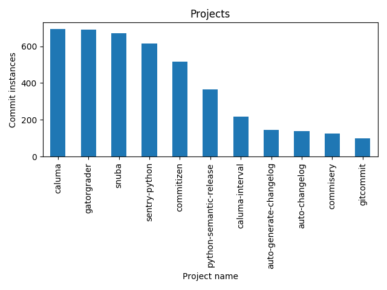
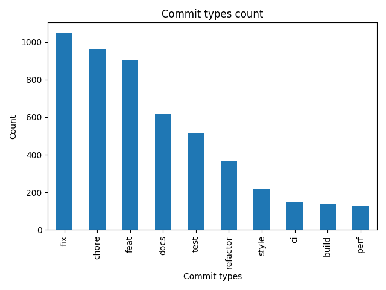
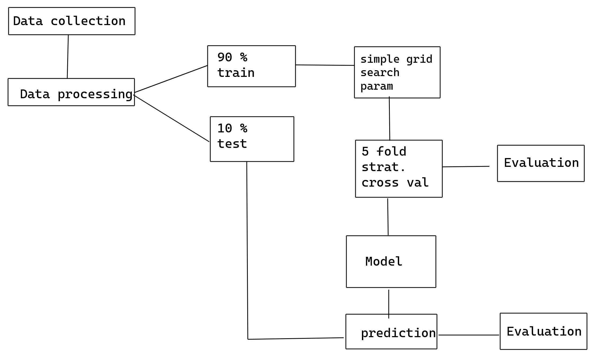
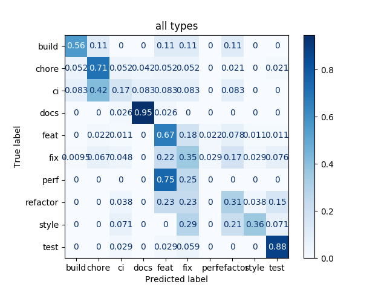

## Data Collection and processing

### Selecting repositories

[tooling for conventional commits](https://www.conventionalcommits.org/en/v1.0.0/#tooling-for-conventional-commits)

[tools using conventional commits](https://www.conventionalcommits.org/en/v1.0.0/#projects-using-conventional-commits)

Other tools from Github

Notes: Challenges with finding appropriate repositories



### Data Collection with Pydriller

Collect commits that have conventional commit messages with following types:
feat, test, refactor, docs, chore, fix, perf, style, ci, build

Notes: Class imbalance




| Collected with Pydriller | Engineered features                                                                                       |
|--------------------------|-----------------------------------------------------------------------------------------------------------|
| Total lines of codes     | ratio of modified files that don't have source code                                                       |
| lines added              | used for calculating net lines added                                                                      |
| lines removed            | used for calculating net lines added                                                                      |
| file names               | total number of files modified number of unique file extensions ratio of file extensions with .md or .rst |
| file paths               | ratio of file paths that have word "test" in it                                                           |
| diffs                    | Similarity index between lines added and deleted using SequenceMatcher                                    |


```
feature importances

Variable: similarity           Importance: 0.18
Variable: docs_related         Importance: 0.13
Variable: nlocs                Importance: 0.13
Variable: test_related         Importance: 0.12
Variable: added                Importance: 0.11
Variable: total                Importance: 0.1
Variable: none_src_files       Importance: 0.09
Variable: removed              Importance: 0.08
Variable: num_files            Importance: 0.04
Variable: unique_file_formats  Importance: 0.02
```

### Data processing

Remove the rows with Nan values
  

## Random forest model

### Sketch



### Model trained and tested on individual types



```

5 fold stratified cross validation on train set

               metric  test_mean  test_std  train_mean  train_std
0     recall_weighted       0.61      0.01        0.78        0.0
1  precision_weighted       0.64      0.01        0.81        0.0
2         f1_weighted       0.62      0.01        0.79        0.0 

classification report for testing dataset

              precision    recall  f1-score   support

       build       0.42      0.56      0.48         9
       chore       0.82      0.71      0.76        96
          ci       0.12      0.17      0.14        12
        docs       0.88      0.95      0.91        38
        feat       0.59      0.67      0.63        90
         fix       0.51      0.35      0.42       105
        perf       0.00      0.00      0.00         4
    refactor       0.20      0.31      0.24        26
       style       0.50      0.36      0.42        14
        test       0.65      0.88      0.75        34

    accuracy                           0.59       428
   macro avg       0.47      0.49      0.47       428
weighted avg       0.60      0.59      0.59       428

```

### Model trained and tested on Grouped types


```
5 fold stratified cross validation on train set

               metric  test_mean  test_std  train_mean  train_std
0     recall_weighted       0.72      0.01        0.83       0.00
1  precision_weighted       0.72      0.01        0.83       0.01
2         f1_weighted       0.72      0.01        0.83       0.01 

classification report for testing dataset

              precision    recall  f1-score   support

       chore       0.89      0.81      0.84       118
        docs       0.79      0.87      0.82        38
   feat/perf       0.69      0.73      0.71        94
     fix/ref       0.73      0.65      0.69       131
       style       0.45      0.77      0.57        13
        test       0.72      0.85      0.78        34

    accuracy                           0.75       428
   macro avg       0.71      0.78      0.74       428
weighted avg       0.76      0.75      0.75       428

```


